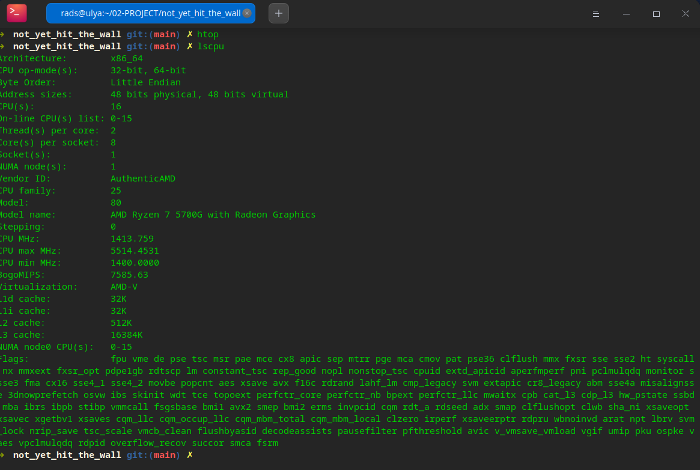
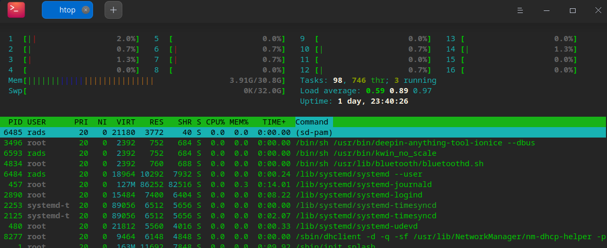
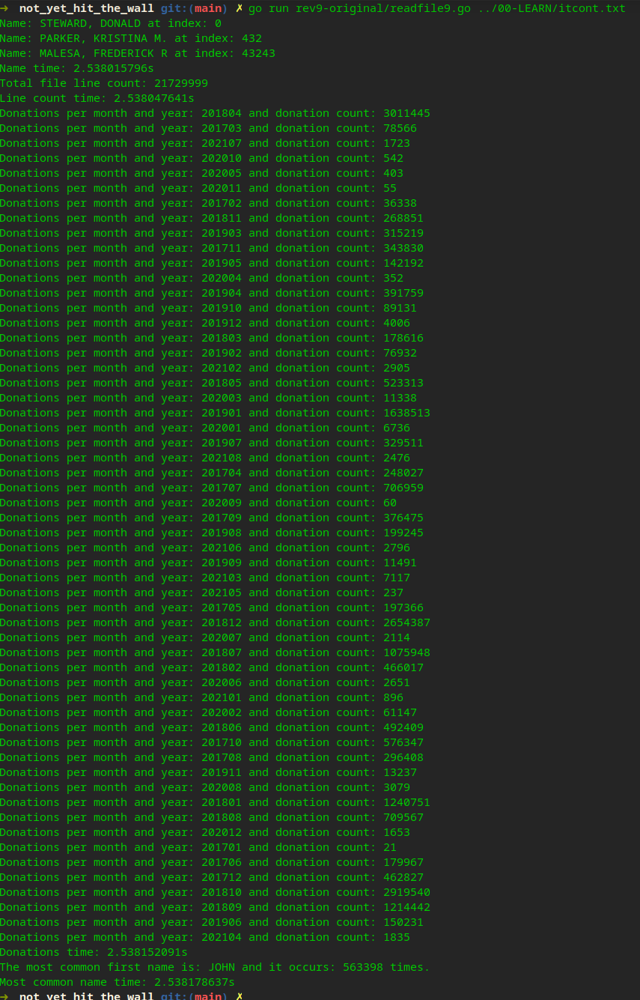
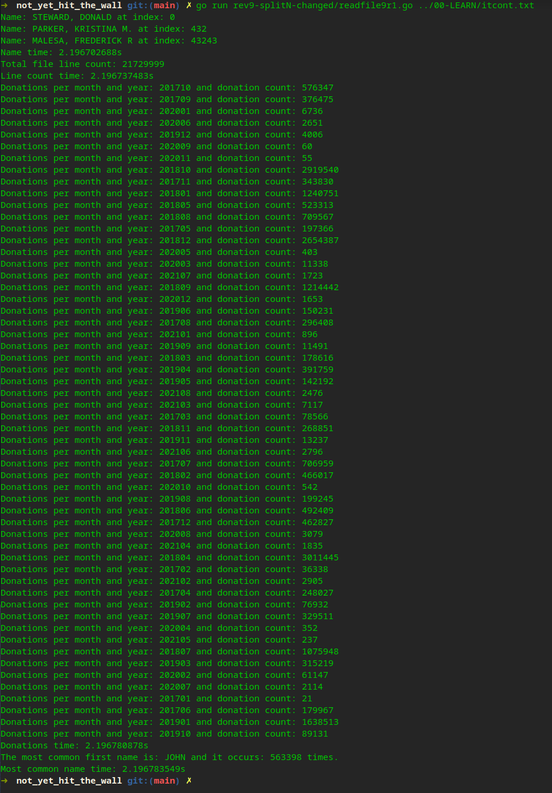
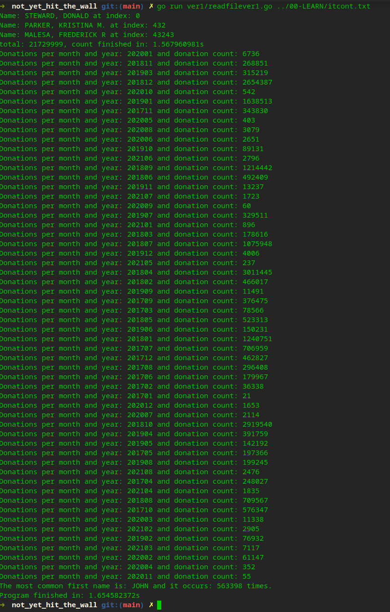
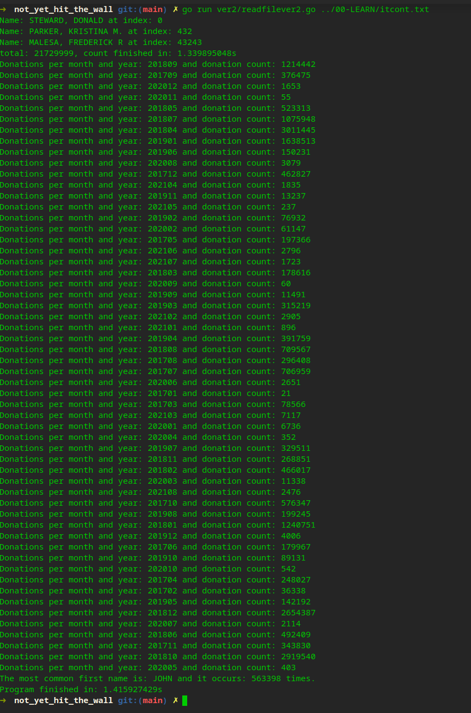
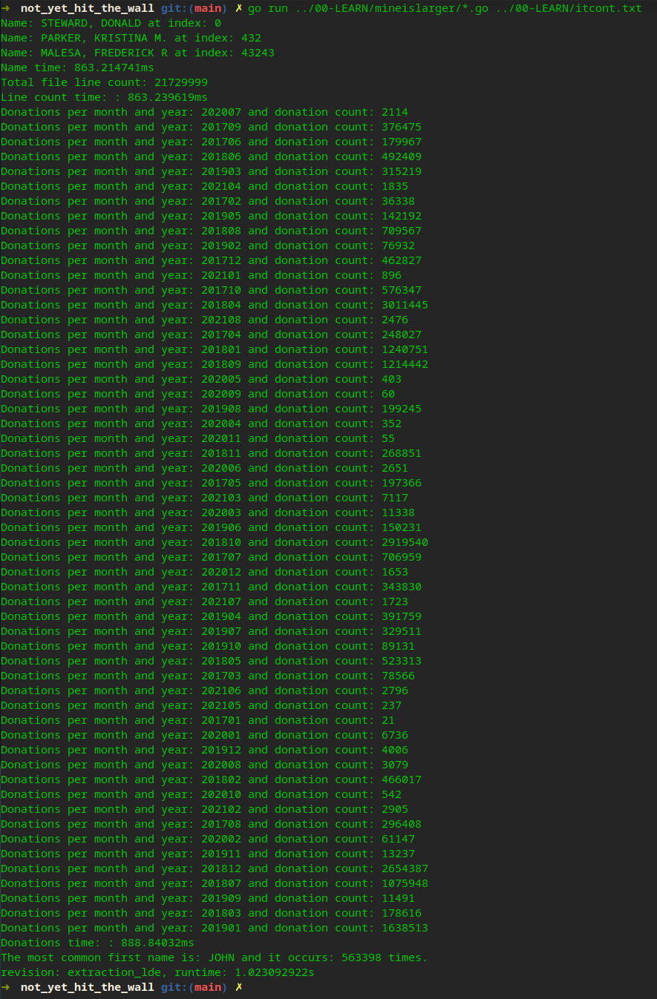
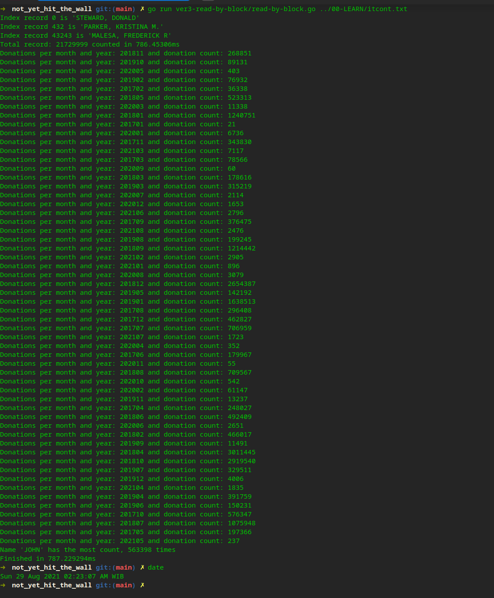

# not_yet_hit_the_wall
Processing large file - go

After reading Marcel Lanz's tweet (seems somebody liked it, and it wa shown in my twitter's home), 
and read his blog (https://marcellanz.com/post/file-read-challenge/  -- read it...it's fun and helpful!),
i tried to get his rev9 work and run it in my new build mini ITX PC (Ryzen 5700G with 32GB RAM and NVME)

with no other program opened, except the terminal

and run it with the latest go 1.17

It's faaaaaaast, only 2.5s to process the file.
So i give it a try to see if i can change something to make it runs faster,
i changed the strings.SplitN to a less-alloc code, and see the improvement

its ~2.2s now, seems interesting to see if I can do other improvement with the current code.
And after a while, it stuck me in mutex implementation of the code, so i decide to write a version with channel to see if it performs better

~1.7s now, well it make me curious more if any more juice can be squeezed, then the blog mention to optimize on the reading process,
so i moved the scanner from the standard library and read it using regular read and bytes.Index

it goes down to ~1.4s ...great
Then, i remember the blog mention the fastest implementation, so i download sirkon's (https://github.com/sirkon/mineislarger)
Run it and amazed...

It's ~1s, soooo faaast... i'm glad that it means more improvement can be done to achieve better performance (optimize my code or rewrite it using different methods)
so far there are somethings i would love to try... i'm sure i'm not yet hit the wall

# UPDATE 2021-08-29 02:25 AM (GMT +7, Jakarta-Indonesia Time)

After one day uploading, and analize the possibilities to conquer sirkon's code performance which is ~1s running in my PC,( check his code at https://github.com/sirkon/mineislarger , btw i haven't analize his code, to keep me looking for fresh solution),
finally i might be hitting the wall...
with another method, my code finally run less then 800ms.....yaaaaayyyyyyyyyyyyyy!!!!

Maybe i'll write the explanation later, but it actually a very simple logic.